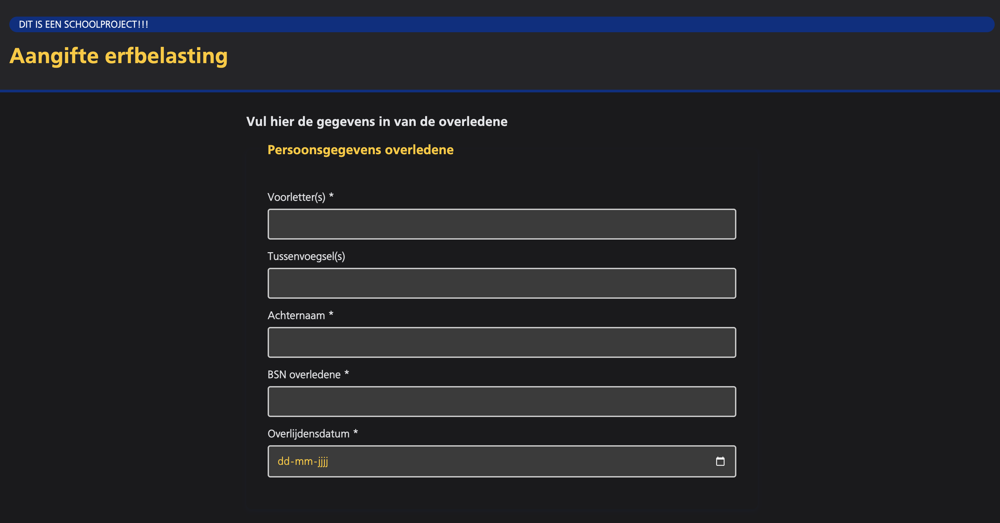
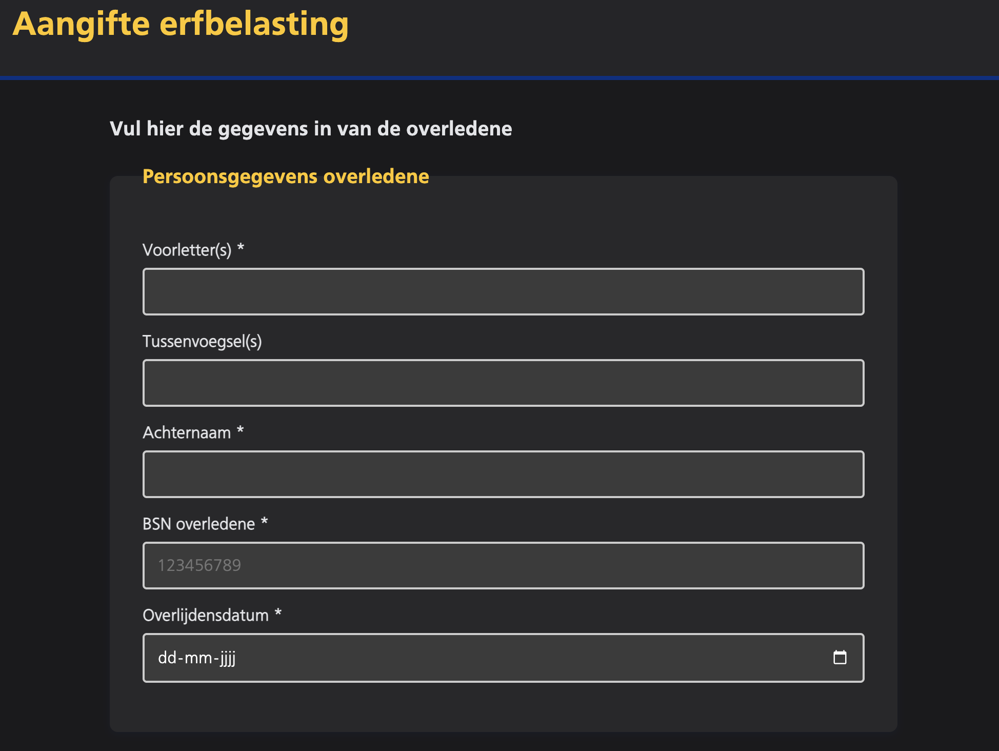
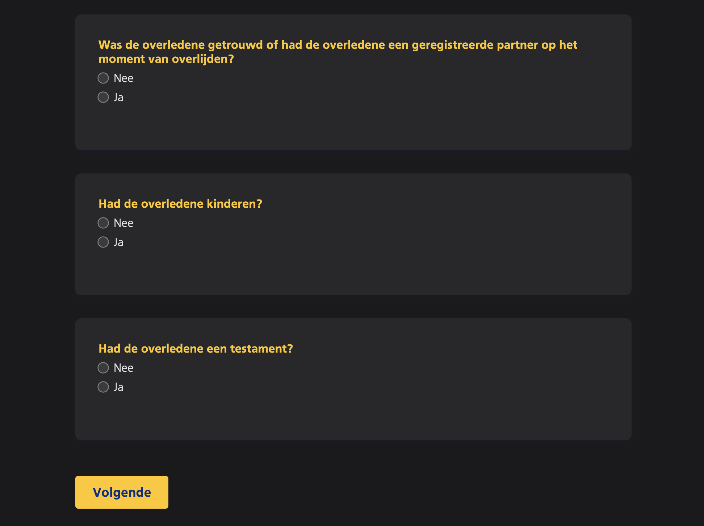
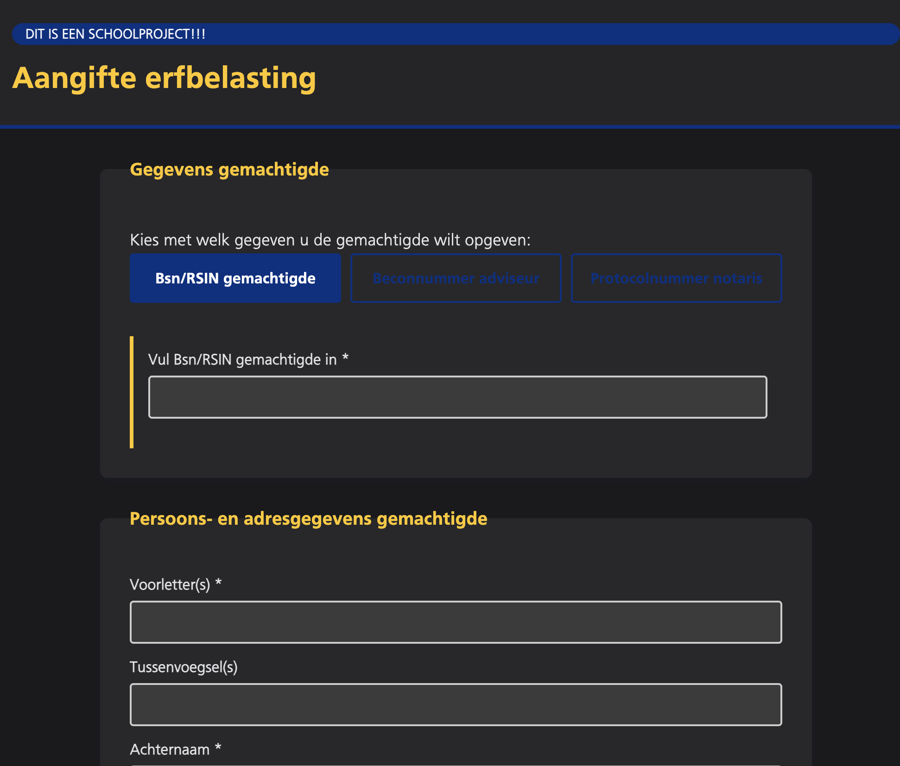
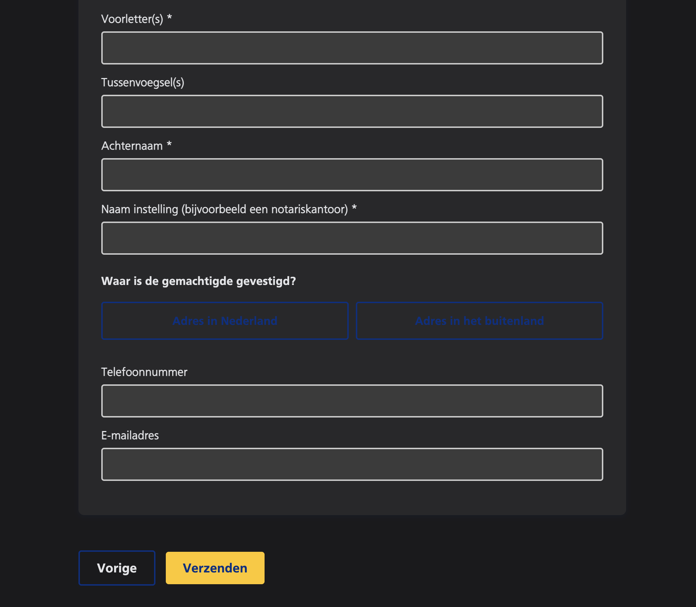
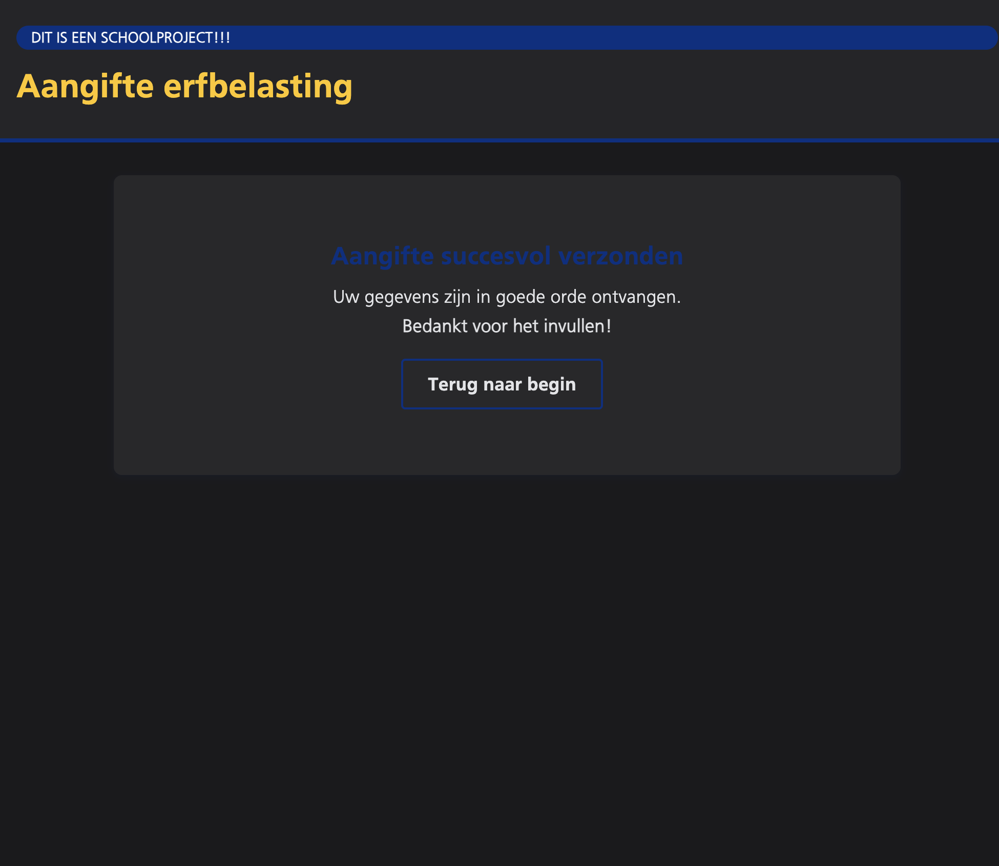

# BrowserTech

## Chech-out (met Jacco)

### Wat heb ik vandaag gedaan

Ik heb vandaag de html gedaan. Hierbij heb ik de eerste pagina gemaakt met alles wat erin moet. Ook heb ik aantekeningen gemaakt voor de weekly geek.

### Hoeveel tijd heeft dat mij gekost

Ik ben hier de hele les mee bezig geweest

### Wat heb ik geleerd

Ik heb geleerd wat je allemaal kan met formulieren. De verschillende input types en fieldsets

### Wat ga ik morgen doen

Verder met de html. Ik ga de tweede pagina maken. Als er tijd over is ga ik alvast beginnen met stylen.

## Check-out (met Jeppe)

### Wat heb ik gedaan

Ik heb vandaag de cursus html gevolgd

### Hoeveel tijd heeft dat mij gekost

Dit heeft mij ongeveer 1,5 uur geduurd

### Wat heb ik geleerd

Ik heb geleerd wat een datalist is en wat je er mee kan doen en gebruiken.

### Wat ga ik morgen doen

Morgen ga ik beginnen met het nieuwe vak css. 

## Check-out (met Justin)

### Wat heb ik gedaan

Ik heb vandaag de cursus validation gevolgd.

### Hoeveel tijd heeft dat mij gekost

Dit heeft mij iets van 1,5 gekost

### Wat heb ik geleerd

Ik weet nu meer over hoe je forms moet valideren. Ook weet ik nu hoe je bijvoorbeeld er voor zorgt dat een postcode geldig is. Dit doe je met regular expressions

### Wat ga ik morgen doen

Morgen ga ik zorgen dat ik echt met de styling verder ga.

## Check-out (met Mila)

### Wat heb ik gedaan

Ik heb vandaag de styling gedaan van mijn project

### Hoeveel tijd heeft dat mij gekost

Dit heeft mij ongeveer 5 uurtjes gekost.

### Wat heb ik geleerd

Ik heb geleerd hoe je de formulieren moet stylen

### Wat ga ik morgen doen

Morgen ga ik een begin maken voor de control panel. Ik wil hierbij een nintendo switch gaan maken en proberen het design af te krijgen. Ik ga me nog niet bezighouden met functionaliteiten.

## *9 maart 2026*
### Check-out (met Mitchell)
**Wat heb ik vandaag gedaan**

Ik ben vandaag verder gegaan met het stylen van het formulier. Ik heb me nu beter aan het ns schema gehouden. Ik heb nu ervoor gezorgd dat er een light en dark mode is. Hierbij heb ik de juiste kleuren gebruikt met de precieze hex codes. Ook heb ik het font gedownload van de ns. Ik heb deze in de gitignore gezet zodat die niet gebruikt word.

**Hoeveel tijd heeft dat mij gekost**

Ik ben hier de ochtend aan begonnen en ben aan het eind van de les eigenlijk nog niet klaar.

**Wat heb ik geleerd**

Ik heb geleerd hoe ik het font in de gitignore moet zetten en hoe ik de font moet downloaden.

**Wat ga ik morgen doen**

Verder met stylen en kijken of ik al wat met validation kan doen

## *10 maart 2026*
### Check-out (met Alex)
**Wat heb ik vandaag gedaan**

Ik heb vandaag de styling gedaan. Ik heb deze nu zo goed als af. 
Ook heb ik de workshop over toegankelijkheid gedaan. Dit was best wel handig, alleen ging soms een beetje snel want was best veel javascript

**Hoeveel tijd heeft dat mij gekost**

Ik ben hier de hele les mee bezig geweest. 

**Wat heb ik geleerd**

Ik heb geleerd hoe ik bezig kan met toegankelijkheid. Ook weet ik wat beter wat er nou met patterns bedoeld word. 

**Wat ga ik morgen doen**

Morgen ga ik verder met het css vak. Ik wil ervoor zorgen dat de switch responsive word. Als het scherm klein is gaan de joycons van het display af. 

## *16 maart 2026*
### Check-out (met Ocean)
**Wat heb ik vandaag gedaan**

Vandaag heb ik de progressive disclosure als pattern in de website gezet.

**Hoeveel tijd heeft dat mij gekost**

Ik ben hier de hele les mee bezig geweest

**Wat heb ik geleerd**

Ik weet nu dat de progressive disclosure gewoon met puur css kan. Ik dacht de hele tijd dat je hiervoor javascript nodig had. Je kan gelukkig gewoon de has() gebruiken met css hiervoor

**Wat ga ik morgen doen**

Morgen ga ik verder met het het formulier. Dan ga ik de validatie toevoegen. Ook wil ik voor het vak CSS even verder

## *17 maart 2026*
### Check-out (met Eva)
**Wat heb ik vandaag gedaan**

Ik ben verder gegaan met de progressive disclosure en die is nu af

**Hoeveel tijd heeft dat mij gekost**

Ik ben hier de hele les mee bezig geweest

**Wat heb ik geleerd**

Ik heb geleerd dat je fieldsets kan weghalen en laten verschijnen met display none en display block

**Wat ga ik morgen doen**

Morgen ga ik verder met de opdracht van het vak css

## Eindproduct

## Herkansing
Voor de herkansing heb ik best wat dingen aangepast. Ik heb er nu voor gezorgd dat ik m'n eerste pattern goed heb gekregen. Dit is bij mij de progressive disclosure. Als je er nu op klikt en je toch van antwoord wil wisselen gaat die ook echt weg en blijft die niet staan zoals die eerst deed. Die werkt nu goed. Ik heb aan de validatie gewerkt. Ik heb bijvoorbeeld ervoor gezorgd dat het een gelding bsn nummer moet zijn met de elfproef. Je kan nu pas het formulier versturen als alles goed is ingevuld. Ook heb ik een tweede en een derde pattern zelfs toegevoegd. Ik heb er voor gezorgd dat je kan kiezen uit een van de 3 opties. BSN/RSIN nummer, beconnummer of het notarisnummer. Ook heb ik als extraatje omdat ik had gezegd dat ik die ging doen een datalist met de landen toegevoegd als derde pattern. 
Ik heb knoppen toegevoegd die ook alleen werken als alles is ingevuld. Als iets niet is ingevuld komt er met een wolkje te staan wat nog ingevuld moet worden. Als je alles heb ingevuld en je het formulier wil versturen controleerd die of alle required fields zijn ingevuld. Zo nee, dan verstuurt die het niet en zegt die wat je mist. Zo ja, dan word je naar een volgende pagina gestuurd met een melding dat het succesvol is ingeleverd.
Ook heb een favicon toegevoegd.

## Herkansing eindproduct

### Bronnenlijst

https://tractie.ns.nl/2e23992f3/p/226ce1-tractie--ns-design-system
https://www.ns.nl/?utm_source=google&utm_medium=Paid_Search&utm_campaign=NSR-CORP-BR-corporate_C13090&utm_content=&utm_term=ns&utm_id=google_ads_16495705419&gad_source=1&gad_campaignid=16495705419&gbraid=0AAAAADPhMscOGsnbLvpfSAEeOuyJlImTK&gclid=Cj0KCQjw4PPNBhD8ARIsAMo-icyUSpHJsk1Lix_XuScoY1gTeSYlMBf6a0xTNYppQXmAS-pSRPdECgIaAveIEALw_wcB
https://download.belastingdienst.nl/belastingdienst/docs/aangifte_erfbel_2025_suc0602z52fol.pdf
https://gemini.google.com/app?hl=nl
https://developer.mozilla.org/en-US/docs/Web/HTML/Reference/Attributes/maxlength
https://help.afas.nl/meldingen/NL/SE/137666.htm
https://fiscaal-online.nl/uitstelregeling/hoe-krijg-ik-een-beconnummer
https://finom.co/nl-nl/blog/rsin-nummer/?utm_source=www.google.com&utm_medium=referral